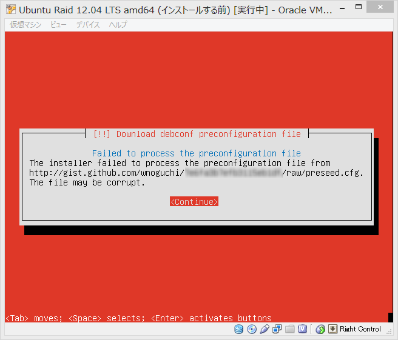

# Ubuntuの自動インストール

刺し身タンポポ作業の自動化。  
CentOSならKickstart使うことになるけど、Ubuntuの場合はPreseedingというツールを使うらしい。

現状の僕のやりたい設定としては現在確認している限りでは

- https://raw.github.com/wnoguchi/ubuntu_documents/master/preseed/preseed.cfg/pxe/basic/preseed.cfg
- https://raw.github.com/wnoguchi/ubuntu_documents/master/preseed/preseed.cfg/pxe/partman/preseed-raid-lvm.cfg

の `preseed.cfg` が一番正しい。

## 環境

- 母艦: Ubuntu 13.04 Desktop
- ISO化するもの: Ubuntu Server 12.04.3 LTS

## 必要なやつをインストール

```
sudo apt-get -y install syslinux mtools mbr genisoimage dvd+rw-tools
```

## 作業ディレクトリ作成

```
mkdir -p /var/tmp/ubuntu1204/{dvd,dvdr}
cd /var/tmp/ubuntu1204/
```

## マウント

isoイメージはループバックデバイスだから他に何かオプション指定しないといけない気がしたんだけど。。。

```
sudo mount -t iso9660 /var/tmp/ubuntu-12.04.3-server-amd64.iso /var/tmp/ubuntu1204/dvd
```

## isoイメージからファイルコピー

```
cd dvd
find . ! -type l | cpio -pdum ../dvdr/
1340648 ブロック

```

## 自動インストールを実現するためのisolinux.cfg ファイルの編集

```
cd ../dvdr/
ls -F
EFI/		    boot/	   dists/  install/   md5sum.txt  pool/
README.diskdefines  cdromupgrade*  doc/    isolinux/  pics/	  preseed/
```

`isolinux.cfg` から多重に include されているものを辿って行くと、 `dvdr/isolinux/txt.cfg` は以下のようになっていて、

```
# dvdr/isolinux/txt.cfg
default install
label install
  menu label ^Install Ubuntu Server
  kernel /install/vmlinuz
  append  file=/cdrom/preseed/ubuntu-server.seed vga=788 initrd=/install/initrd.gz quiet --
label cloud
  menu label ^Multiple server install with MAAS
  kernel /install/vmlinuz
  append   modules=maas-enlist-udeb vga=788 initrd=/install/initrd.gz quiet --
label check
  menu label ^Check disc for defects
  kernel /install/vmlinuz
  append   MENU=/bin/cdrom-checker-menu vga=788 initrd=/install/initrd.gz quiet --
label memtest
  menu label Test ^memory
  kernel /install/mt86plus
label hd
  menu label ^Boot from first hard disk
  localboot 0x80
```

この中から

```
default install
label install
  menu label ^Install Ubuntu Server
  kernel /install/vmlinuz
  append  file=/cdrom/preseed/ubuntu-server.seed vga=788 initrd=/install/initrd.gz quiet --
```

のような内容を見つけることができます。  
この内容の append の行を

```
  append  file=/cdrom/preseed/ubuntu-server.seed vga=788 initrd=/install/initrd.gz quiet --
```

以下のように書き換えます。

```
  append DEBCONF_DEBUG=5 auto=true locale=en_US.UTF-8 console-setup/charmap=UTF-8 console-setup/layoutcode=us console-setup/ask_detect=false pkgsel/language-pack-patterns=pkgsel/install-language-support=false interface=eth0 hostname=localhost domain=localdomain url=http://gist.github.com/wnoguchi/6578034/raw/preseed.cfg vga=normal initrd=/install/initrd.gz quiet --
```

次に `txt.cfg` ではなく `isolinux.cfg` を編集します。  
ファイルの中身

```
# dvdr/isolinux/isolinux.cfg
# D-I config version 2.0
include menu.cfg
default vesamenu.c32
prompt 0
timeout 0
ui gfxboot bootlogo
```

を

```
# dvdr/isolinux/isolinux.cfg
default install
label install
  menu label ^Install Ubuntu Server
  kernel /install/vmlinuz
  append DEBCONF_DEBUG=5 auto=true locale=en_US.UTF-8 console-setup/charmap=UTF-8 console-setup/layoutcode=us console-setup/ask_detect=false pkgsel/language-pack-patterns=pkgsel/install-language-support=false interface=eth0 hostname=localhost domain=localdomain url=http://gist.github.com/wnoguchi/6578034/raw/preseed.cfg vga=normal initrd=/install/initrd.gz quiet --
label hd
  menu label ^Boot from first hard disk
  localboot 0x80
```

に全置換します。  
読み取り専用になってるので!を付加して強制的に書き込む。

## 自動インストールを実現するための preseed.cfg ファイルの作成

```
# dvdr/preseed/preseed.cfg
#===========================================================================================
# BOOT SEQUENCE CONFIGURATIONS START
# ENDの設定のところまではDVDメディア、USBメディアに同梱している場合にのみ有効になる設定。
# PXEブートの場合はこのセクションは無視される。
# この場合はpxelinuxのconfigのappendに直接記述する必要がある。
#===========================================================================================
d-i debian-installer/language string en
d-i debian-installer/country string US
d-i debian-installer/locale string en_US.UTF-8
d-i localechooser/supported-locales en_US.UTF-8
d-i console-setup/ask_detect boolean false
d-i console-setup/layoutcode string us
d-i console-setup/charmap select UTF-8
 
# キーボードレイアウトの特性の設定（日本語キーボード）
d-i keyboard-configuration/layoutcode string jp
d-i keyboard-configuration/modelcode jp106
 
#===========================================================================================
# ネットワークまわりの設定
#-------------------------------------------------------------------------------------------
# 静的IP
#-------------------------------------------------------------------------------------------
# preseed.cfgを外から持ってこようとするとどうしてもいったんDHCP解決しないといけない。
# そして以下の netcfg 項目は一回目は無視されるので d-i preseed/run のところで
# ネットワーク設定をリセットするハックが必要になる。
# そうすると静的IPとして設定を直してくれるようになる。
#
# 詳しくは以下:
# - https://help.ubuntu.com/lts/installation-guide/i386/preseed-contents.html
# - http://debian.2.n7.nabble.com/Bug-688273-Preseed-netcfg-use-autoconfig-and-netcfg-disable-dhcp-doesn-t-work-td1910023.html
#
# 以下の2項目を設定しないと静的IPとして処理されないので重要
d-i netcfg/use_autoconfig boolean false 
d-i netcfg/disable_autoconfig boolean true 
 
d-i netcfg/choose_interface select eth0 
d-i netcfg/disable_dhcp boolean true 
d-i netcfg/get_nameservers string 8.8.8.8 
d-i netcfg/get_ipaddress string 192.168.1.201 
d-i netcfg/get_netmask string 255.255.255.0 
d-i netcfg/get_gateway string 192.168.1.1 
d-i netcfg/confirm_static boolean true 
d-i netcfg/get_hostname string stack01 
d-i netcfg/get_domain string pg1x.com 
d-i netcfg/wireless_wep string 
#-------------------------------------------------------------------------------------------
# DHCPのとき
#-------------------------------------------------------------------------------------------
#d-i netcfg/choose_interface select eth0 
#d-i netcfg/disable_autoconfig boolean false
#d-i netcfg/get_hostname string openstack 
#d-i netcfg/get_domain string sv.pg1x.com 
#d-i netcfg/wireless_wep string 
 
# いったんリセット
d-i preseed/run string http://raw.github.com/wnoguchi/install-automation-recipes/master/Ubuntu/commons/prescript.sh
#===========================================================================================
# BOOT SEQUENCE CONFIGURATIONS END
#===========================================================================================
 
# インストーラパッケージをダウンロードするミラーを選択する
#d-i mirror/protocol http
d-i mirror/country string manual
d-i mirror/http/hostname string jp.archive.ubuntu.com
d-i mirror/http/directory string /ubuntu/
d-i mirror/http/proxy string
 
# インストールするスイートを選択
d-i mirror/suite precise
 
d-i clock-setup/utc boolean false 
d-i time/zone string Japan 
d-i clock-setup/ntp boolean false 
 
#===========================================================================================
# PARTMAN PARTITIONING SECTION START
#===========================================================================================
# すべてのRAIDデバイス構成を破棄する
d-i partman-md/device_remove_md boolean true
# すべてのLVMデバイス構成を破棄する
d-i partman-lvm/device_remove_lvm boolean true
 
d-i partman/confirm_nooverwrite boolean true
 
d-i partman-auto/disk string /dev/sda
d-i partman-auto/method string regular
d-i partman-auto/expert_recipe string root :: 19000 50 50000 ext4 \
        $primary{ } $bootable{ } method{ format } \
        format{ } use_filesystem{ } filesystem{ ext4 } \
        mountpoint{ / } \
    . \
    16384 90 32768 linux-swap \
        $primary{ } method{ swap } format{ } \
    . \
    100 100 10000000000 ext3 \
        $primary{ } method{ format } format{ } \
        use_filesystem{ } filesystem{ ext4 } \
        mountpoint{ /srv/extra } \
    .
d-i partman-auto/choose_recipe select root
d-i partman-partitioning/confirm_write_new_label boolean true
d-i partman/choose_partition select Finish partitioning and write changes to disk
d-i partman/confirm boolean true
#===========================================================================================
# PARTMAN PARTITIONING SECTION END
#===========================================================================================
 
d-i base-installer/install-recommends boolean true 
d-i base-installer/kernel/image string linux-generic 
 
d-i passwd/root-login boolean true 
d-i passwd/make-user boolean false 
d-i passwd/root-password password password 
d-i passwd/root-password-again password password 
d-i passwd/user-fullname string testuser 
d-i passwd/username string testuser 
d-i passwd/user-password password insecure 
d-i passwd/user-password-again password insecure 
d-i user-setup/allow-password-weak boolean true 
d-i user-setup/encrypt-home boolean false 
 
d-i apt-setup/use_mirror boolean true 
 
d-i debian-installer/allow_unauthenticated boolean true 
tasksel tasksel/first multiselect none 
d-i pkgsel/include string openssh-server build-essential
d-i pkgsel/upgrade select none 
d-i pkgsel/update-policy select none 
d-i pkgsel/install-language-support boolean true 
popularity-contest popularity-contest/participate boolean false 
d-i pkgsel/updatedb boolean true 
 
# GRUBインストーラー
d-i grub-installer/grub2_instead_of_grub_legacy boolean true 
d-i grub-installer/only_debian boolean true 
d-i grub-installer/bootdev string /dev/sda
 
# インストールが終了したらサーバー再起動
d-i finish-install/reboot_in_progress note
```

## カスタムisoイメージを作成する

```
cd /var/tmp/ubuntu1204
sudo genisoimage -N -J -R -D -V "PRESEED" -o ubuntu-12.04-server-amd64-preseed.iso -b isolinux/isolinux.bin -c isolinux/boot.cat -no-emul-boot -boot-load-size 4 -boot-info-table dvdr

(snip)

 93.17% done, estimate finish Mon Aug 26 23:25:33 2013
 94.65% done, estimate finish Mon Aug 26 23:25:33 2013
 96.13% done, estimate finish Mon Aug 26 23:25:33 2013
 97.61% done, estimate finish Mon Aug 26 23:25:34 2013
 99.08% done, estimate finish Mon Aug 26 23:25:34 2013
Total translation table size: 2048
Total rockridge attributes bytes: 371263
Total directory bytes: 1908736
Path table size(bytes): 12978
Max brk space used 369000
338099 extents written (660 MB)
```

## 実行してみる

いきなり物理マシンにやるのはけっこうしんどいので仮想マシンでやってみる。  
うまくいった。

設定ファイルは [DVD self contains Basic Preseeding](preseed.cfg/dvd-self-contain/basic/README.md) を参照。

## PXE+Preseedでやってみた

192.168.1.10がPXEブートサーバー兼TFTPサーバーとなっている。  
pxelinuxでブート時にTFTPサーバーからpreseedファイルを取得してきている。  
パスに注意。  
PXEブートサーバーについては [doc/Network/pxe/ubuntu-pxe.md at master · wnoguchi/doc](https://github.com/wnoguchi/doc/blob/master/Network/pxe/ubuntu-pxe.md) を参照。

## トラブルシューティング

### 静的IPにしたいのにDHCP解決しちゃう！助けて！

以下のような `prescript.sh` を用意する。

```
#!/bin/sh
killall.sh; netcfg
```

```
#===========================================================================================
# BOOT SEQUENCE CONFIGURATIONS START
# ENDの設定のところまではDVDメディア、USBメディアに同梱している場合にのみ有効になる設定。
# PXEブートの場合はこのセクションは無視される。
# この場合はpxelinuxのconfigのappendに直接記述する必要がある。
#===========================================================================================
d-i debian-installer/language string en
d-i debian-installer/country string US
d-i debian-installer/locale string en_US.UTF-8
d-i localechooser/supported-locales en_US.UTF-8
d-i console-setup/ask_detect boolean false
d-i console-setup/layoutcode string us
d-i console-setup/charmap select UTF-8

# キーボードレイアウトの特性の設定（日本語キーボード）
d-i keyboard-configuration/layoutcode string jp
d-i keyboard-configuration/modelcode jp106

#===========================================================================================
# ネットワークまわりの設定
#-------------------------------------------------------------------------------------------
# 静的IP
#-------------------------------------------------------------------------------------------
# preseed.cfgを外から持ってこようとするとどうしてもいったんDHCP解決しないといけない。
# そして以下の netcfg 項目は一回目は無視されるので d-i preseed/run のところで
# ネットワーク設定をリセットするハックが必要になる。
# そうすると静的IPとして設定を直してくれるようになる。
#
# 詳しくは以下:
# - https://help.ubuntu.com/lts/installation-guide/i386/preseed-contents.html
# - http://debian.2.n7.nabble.com/Bug-688273-Preseed-netcfg-use-autoconfig-and-netcfg-disable-dhcp-doesn-t-work-td1910023.html
#
# 以下の2項目を設定しないと静的IPとして処理されないので重要
d-i netcfg/use_autoconfig boolean false 
d-i netcfg/disable_autoconfig boolean true 

d-i netcfg/choose_interface select eth0 
d-i netcfg/disable_dhcp boolean true 
d-i netcfg/get_nameservers string 8.8.8.8 
d-i netcfg/get_ipaddress string 192.168.1.50 
d-i netcfg/get_netmask string 255.255.255.0 
d-i netcfg/get_gateway string 192.168.1.1 
d-i netcfg/confirm_static boolean true 
d-i netcfg/get_hostname string openstack 
d-i netcfg/get_domain string sv.pg1x.com 
d-i netcfg/wireless_wep string 
#-------------------------------------------------------------------------------------------
# DHCPのとき
#-------------------------------------------------------------------------------------------
#d-i netcfg/choose_interface select eth0 
#d-i netcfg/disable_autoconfig boolean false
#d-i netcfg/get_hostname string openstack 
#d-i netcfg/get_domain string sv.pg1x.com 
#d-i netcfg/wireless_wep string 

# いったんリセット
d-i preseed/run string http://gist.github.com/wnoguchi/7e6fa3b7efb3115eb1df/raw/prescript.sh
#===========================================================================================
# BOOT SEQUENCE CONFIGURATIONS END
#===========================================================================================
```

## デバッグに関して

カーネルパラメータに `DEBCONF_DEBUG=5` を指定するとログ出力されるので便利。  
**インストール中にPreseedのログを確認したいときは `Alt+F4` の仮想コンソールで見ることができる。便利。**  
Preseedに関連するコマンドもここで出力されるのでこれを見ながら設定していくといい。  
というかこれ以外まともなドキュメントが存在しない。  
Kickstartよりひどい。  
たぶん `/var/log/installer/syslog`  に出力されるのが Preseed に関するログ。

### preseed.cfgがぶっ壊れている時に表示される画面



## 参考サイト

- [Ubuntu Serverの全自動インストール環境作成 - kinneko@転職先募集中の日記](http://d.hatena.ne.jp/kinneko/20130203/p1)
- [Ubuntu Serverの完全自動インストールISOの作成（Preseeding） - SharpLab.](http://blog.sharplab.net/blog/2012/11/11/ubuntu-server%E3%81%AE%E5%AE%8C%E5%85%A8%E8%87%AA%E5%8B%95%E3%82%A4%E3%83%B3%E3%82%B9%E3%83%88%E3%83%BC%E3%83%ABiso%E3%81%AE%E4%BD%9C%E6%88%90%EF%BC%88preseeding%EF%BC%89/)
- [PreseedによるUbuntu ServerのインストールCD作成手順(PDF)](http://h50146.www5.hp.com/products/software/oe/linux/mainstream/support/lcc/pdf/edlin_20110804.pdf)
- [Appendix B. Automating the installation using preseeding](https://help.ubuntu.com/12.04/installation-guide/amd64/appendix-preseed.html)
- [Contents of the preconfiguration file (for precise)](https://help.ubuntu.com/lts/installation-guide/i386/preseed-contents.html)
- [B.2. preseed の利用](http://www.debian.org/releases/stable/s390x/apbs02.html.ja)
- [Advanced options](https://help.ubuntu.com/lts/installation-guide/i386/preseed-advanced.html)
- [preseedを使ってDebian GNU/Linux 5.0.4(netinst)のインストール自動化を行う手順 - 富士山は世界遺産](http://d.hatena.ne.jp/fujisan3776/20100630/1277861431)
- [Contents of the preconfiguration file (for precise)](https://help.ubuntu.com/lts/installation-guide/i386/preseed-contents.html#preseed-bootloader)
- [GPT対応のpreseedの書き方 — ペンギンと愉快な機械の日々](http://d.palmtb.net/2012/12/14/writing_preseed_for_gpt.html)
- [Notes on using expert_recipe in Debian/Ubuntu Preseed Files | Semi-Empirical Shenanigans](http://cptyesterday.wordpress.com/2012/06/17/notes-on-using-expert_recipe-in-debianubuntu-preseed-files/)
- [B.5. 高度なオプション](http://www.debian.org/releases/stable/s390x/apbs05.html.ja)

### Ubuntu Official Installation Guide(AMD64)

- [Installation Guide for Ubuntu 12.04](https://help.ubuntu.com/lts/installation-guide/)
- [Ubuntu Installation Guide](https://help.ubuntu.com/lts/installation-guide/amd64/index.html)
- [Appendix B. Automating the installation using preseeding](https://help.ubuntu.com/lts/installation-guide/amd64/appendix-preseed.html)
- [Contents of the preconfiguration file (for precise)](https://help.ubuntu.com/lts/installation-guide/amd64/preseed-contents.html)
- [Using preseeding](https://help.ubuntu.com/lts/installation-guide/amd64/preseed-using.html#preseed-bootparms)
