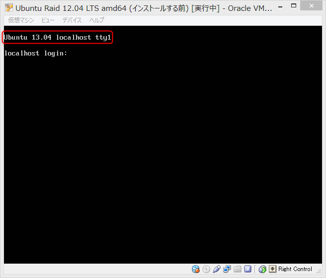
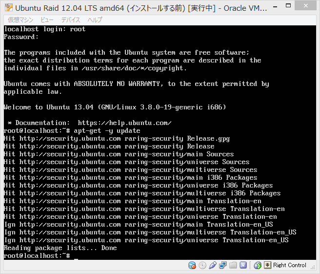
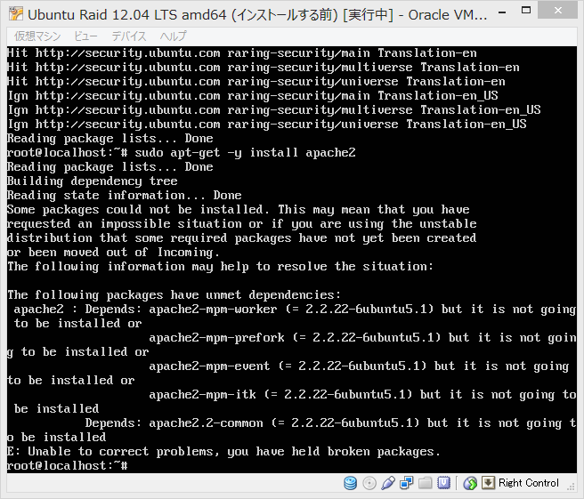
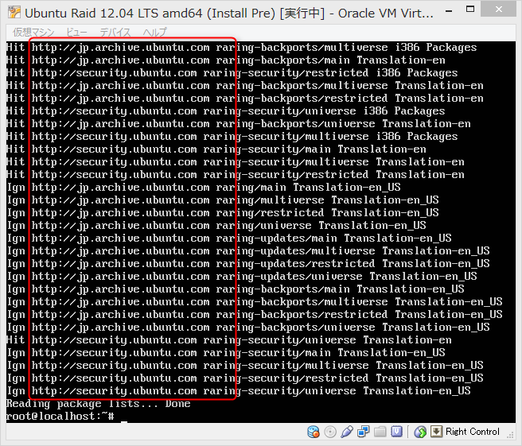

# PXE boot Preseeding + partmanによるパーティショニング

- PXEブートタイプの設定ファイル
- パーティショニングの設定に主眼を置く

## 超基本的な設定

以下の条件を仮定する。

- 実装メモリ: 16GB
- HDD: 2TB

実装メモリ16GBなので最大32GBまでswapを伸長する。  
そしてrootパーティション以外の領域はすべて `/srv/extra` に割り当てる。

```
# Destroy All RAID device settings
d-i partman-md/device_remove_md boolean true
# Destroy All LVM device settings
d-i partman-lvm/device_remove_lvm boolean true

d-i partman-auto/disk string /dev/sda
d-i partman-auto/method string regular
d-i partman-auto/expert_recipe string root :: 19000 50 50000 ext4 \
        $primary{ } $bootable{ } method{ format } \
        format{ } use_filesystem{ } filesystem{ ext4 } \
        mountpoint{ / } \
    . \
    32768 90 32768 linux-swap \
        $primary{ } method{ swap } format{ } \
    . \
    100 100 10000000000 ext3 \
        $primary{ } method{ format } format{ } \
        use_filesystem{ } filesystem{ ext4 } \
        mountpoint{ /srv/extra } \
    .
d-i partman-auto/choose_recipe select root
d-i partman-partitioning/confirm_write_new_label boolean true
d-i partman/choose_partition select Finish partitioning and write changes to disk
d-i partman/confirm boolean true
```

以下、解説。

まず、既にRAIDの設定がしてあると「RAID消すけどいいですか？」って確認画面が出てしまうので「どうぞ削除してください」っていう命令を出す。

```
d-i partman-md/device_remove_md boolean true
```

次、「LVM消すけどいいですか？」って確認画面が出るので「どうぞ削除してください」と答える。

```
d-i partman-lvm/device_remove_lvm boolean true
```

## ソフトウェアRAID1 + LVMを構成する

以下、まだうまくいってない。

```
# Destroy All RAID device settings
d-i partman-md/device_remove_md boolean true
# Destroy All LVM device settings
d-i partman-lvm/device_remove_lvm boolean true

# RAIDアレイに加えるディスクを指定する
d-i     partman-auto/disk string /dev/sda /dev/sdb

# RAIDを構成する
d-i     partman-auto/method string raid

# LVMを構成する
d-i     partman-lvm/confirm boolean true

# partmanエキスパート: boot-rootレシピを選択する
d-i     partman-auto/choose_recipe select boot-root

# LVMボリュームグループの名前
d-i     partman-auto-lvm/new_vg_name string cinder-volumes

# boot-rootレシピの定義
d-i     partman-auto/expert_recipe string        \
           boot-root ::                          \
             1024 30 1024 raid                   \
                $lvmignore{ }                    \
                $primary{ } $bootable{ } method{ raid }       \
                format{ }                        \
             .                                   \
             50000 50 50000 raid                 \
                $lvmignore{ }                    \
                method{ raid }                   \
                format{ }                        \
             .                                   \
             32768 60 32768 raid                 \
                $defaultignore{ }                \
                $lvmok{ }                        \
                method{ raid }                   \
                format{ }                        \
            .                                    
d-i partman-auto-raid/recipe string \
    1 2 0 ext4 /boot                \
          /dev/sda1#/dev/sdb1       \
    .                               \
    1 2 0 ext4 /                    \
          /dev/sda2#/dev/sdb2       \
    .                               \
    1 2 0 lvm -                     \
          /dev/sda3#/dev/sdb3       \
    .                               \
    1 2 0 swap -                    \
          /dev/sda4#/dev/sdb4       \
    .                               
d-i     mdadm/boot_degraded boolean false
d-i     partman-md/confirm boolean true
d-i     partman-partitioning/confirm_write_new_label boolean true
d-i     partman/choose_partition select Finish partitioning and write changes to disk
d-i     partman/confirm boolean true
d-i     partman-md/confirm_nooverwrite  boolean true
d-i     partman/confirm_nooverwrite boolean true
```

PXEブート方式でネットワークインストールしてるから死ぬほど遅い。。。  
partmanの実験に支障が出るのでベーシックなパッケージはDVDに焼いてpreseed.cfgだけHTTP/TFTPで取得するようにする。

```
# isolinux/isolinux.cfg
default install
label install
  menu label ^Install Ubuntu Server
  kernel /install/vmlinuz
  append DEBCONF_DEBUG=5 auto=true locale=en_US.UTF-8 console-setup/charmap=UTF-8 console-setup/layoutcode=us console-setup/ask_detect=false pkgsel/language-pack-patterns=pkgsel/install-language-support=false interface=eth0 hostname=localhost domain=localdomain url=http://gist.github.com/wnoguchi/blahblahblah/raw/preseed.cfg vga=normal initrd=/install/initrd.gz quiet --
label hd
  menu label ^Boot from first hard disk
  localboot 0x80
```

~~インストールはできたけど起動しない。。。  
ブートローダーのインストール周りがいけないのかな。~~

以下のようにGRUBの部分を設定してみる。

```
d-i grub-installer/grub2_instead_of_grub_legacy boolean true 
d-i grub-installer/only_debian boolean true 
d-i grub-installer/bootdev string /dev/sda /dev/sdb
```

ブートするようになってうまく動くようになったと思った。  
ところがぎっちょん。  
12.04をインストールしたはずなのに13.04と認識している。



`sudo apt-get -y update` してみた。



エラーログをApacheインストールして取得しようとしたらエラーになる。

```
E: Unable to correct problems, you have held broken packages
```



パッケージリポジトリの選択をしくってる気がする。  
RAIDの設定周りもなんかおかしい感じがするのでVirtualBoxで適宜スクリーンショットを取りながら進めよう。

以下の設定をfalseからtrueにしたらうまくいった。  
本家がぶっ壊れてる？

```
d-i apt-setup/use_mirror boolean true 
```

apt-getするとjpのミラーが選択されていることを確認する。  
以下のようになるのが正しい。



## 参考サイト

- [Notes on using expert_recipe in Debian/Ubuntu Preseed Files | Semi-Empirical Shenanigans](http://cptyesterday.wordpress.com/2012/06/17/notes-on-using-expert_recipe-in-debianubuntu-preseed-files/)
