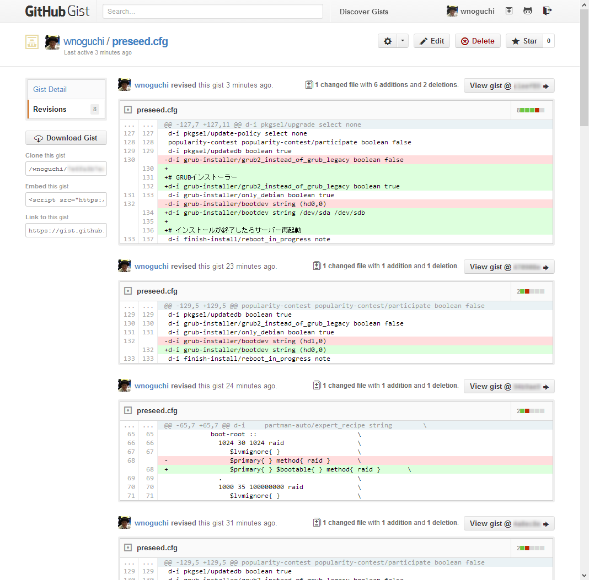

# PXE boot Preseeding + partmanによるパーティショニング

- PXEブートタイプの設定ファイル
- パーティショニングの設定に主眼を置く

## 超基本的な設定

以下の条件を仮定する。

- 実装メモリ: 16GB
- HDD: 2TB

実装メモリ16GBなので最大32GBまでswapを伸長する。  
そしてrootパーティション以外の領域はすべて `/srv/extra` に割り当てる。

```
# Destroy All RAID device settings
d-i partman-md/device_remove_md boolean true
# Destroy All LVM device settings
d-i partman-lvm/device_remove_lvm boolean true

d-i partman-auto/disk string /dev/sda
d-i partman-auto/method string regular
d-i partman-auto/expert_recipe string root :: 19000 50 50000 ext4 \
        $primary{ } $bootable{ } method{ format } \
        format{ } use_filesystem{ } filesystem{ ext4 } \
        mountpoint{ / } \
    . \
    32768 90 32768 linux-swap \
        $primary{ } method{ swap } format{ } \
    . \
    100 100 10000000000 ext3 \
        $primary{ } method{ format } format{ } \
        use_filesystem{ } filesystem{ ext4 } \
        mountpoint{ /srv/extra } \
    .
d-i partman-auto/choose_recipe select root
d-i partman-partitioning/confirm_write_new_label boolean true
d-i partman/choose_partition select Finish partitioning and write changes to disk
d-i partman/confirm boolean true
```

以下、解説。

まず、既にRAIDの設定がしてあると「RAID消すけどいいですか？」って確認画面が出てしまうので「どうぞ削除してください」っていう命令を出す。

```
d-i partman-md/device_remove_md boolean true
```

次、「LVM消すけどいいですか？」って確認画面が出るので「どうぞ削除してください」と答える。

```
d-i partman-lvm/device_remove_lvm boolean true
```

## ソフトウェアRAID1 + LVMを構成する

以下、まだうまくいってない。

```
# Destroy All RAID device settings
d-i partman-md/device_remove_md boolean true
# Destroy All LVM device settings
d-i partman-lvm/device_remove_lvm boolean true

# RAIDアレイに加えるディスクを指定する
d-i     partman-auto/disk string /dev/sda /dev/sdb

# RAIDを構成する
d-i     partman-auto/method string raid

# LVMを構成する
d-i     partman-lvm/confirm boolean true

# partmanエキスパート: boot-rootレシピを選択する
d-i     partman-auto/choose_recipe select boot-root

# LVMボリュームグループの名前
d-i     partman-auto-lvm/new_vg_name string cinder-volumes

# boot-rootレシピの定義
d-i     partman-auto/expert_recipe string        \
           boot-root ::                          \
             1024 30 1024 raid                   \
                $lvmignore{ }                    \
                $primary{ } $bootable{ } method{ raid }       \
                format{ }                        \
             .                                   \
             50000 50 50000 raid                 \
                $lvmignore{ }                    \
                method{ raid }                   \
                format{ }                        \
             .                                   \
             32768 60 32768 raid                 \
                $defaultignore{ }                \
                $lvmok{ }                        \
                method{ raid }                   \
                format{ }                        \
            .                                    
d-i partman-auto-raid/recipe string \
    1 2 0 ext4 /boot                \
          /dev/sda1#/dev/sdb1       \
    .                               \
    1 2 0 ext4 /                    \
          /dev/sda2#/dev/sdb2       \
    .                               \
    1 2 0 lvm -                     \
          /dev/sda3#/dev/sdb3       \
    .                               \
    1 2 0 swap -                    \
          /dev/sda4#/dev/sdb4       \
    .                               
d-i     mdadm/boot_degraded boolean false
d-i     partman-md/confirm boolean true
d-i     partman-partitioning/confirm_write_new_label boolean true
d-i     partman/choose_partition select Finish partitioning and write changes to disk
d-i     partman/confirm boolean true
d-i     partman-md/confirm_nooverwrite  boolean true
d-i     partman/confirm_nooverwrite boolean true
```

PXEブート方式でネットワークインストールしてるから死ぬほど遅い。。。  
partmanの実験に支障が出るのでベーシックなパッケージはDVDに焼いてpreseed.cfgだけHTTP/TFTPで取得するようにする。

```
# isolinux/isolinux.cfg
default install
label install
  menu label ^Install Ubuntu Server
  kernel /install/vmlinuz
  append DEBCONF_DEBUG=5 auto=true locale=en_US.UTF-8 console-setup/charmap=UTF-8 console-setup/layoutcode=us console-setup/ask_detect=false pkgsel/language-pack-patterns=pkgsel/install-language-support=false interface=eth0 hostname=localhost domain=localdomain url=http://gist.github.com/wnoguchi/blahblahblah/raw/preseed.cfg vga=normal initrd=/install/initrd.gz quiet --
label hd
  menu label ^Boot from first hard disk
  localboot 0x80
```

ちなみにpreseed.cfgはgistからとってくるようにしてる。  
変更内容もわかるし、気軽に設定変更できるのですごく便利。  
HTTPSしか無理なのかと思ったけどHTTPでもいける。  
シークレットなgistにしてるのでちょっとだけ安全。  
でも認証かからないからあんまり機密なデータは入れちゃいけません。



~~インストールはできたけど起動しない。。。  
ブートローダーのインストール周りがいけないのかな。~~

以下のようにGRUBの部分を設定してみる。

```
d-i grub-installer/grub2_instead_of_grub_legacy boolean true 
d-i grub-installer/only_debian boolean true 
d-i grub-installer/bootdev string /dev/sda /dev/sdb
```

ブートするようになってうまく動くようになったと思った。  
ところがぎっちょん。  
12.04をインストールしたはずなのに13.04と認識している。


`sudo apt-get -y update` してみた。


エラーログをApacheインストールして取得しようとしたらエラーになる。

```
E: Unable to correct problems, you have held broken packages
```


パッケージリポジトリの選択をしくってる気がする。  
RAIDの設定周りもなんかおかしい感じがするのでVirtualBoxで適宜スクリーンショットを取りながら進めよう。

以下の設定をfalseからtrueにしたらうまくいった。  
本家がぶっ壊れてる？

```
d-i apt-setup/use_mirror boolean true 
```

apt-getするとjpのミラーが選択されていることを確認する。  
以下のようになるのが正しい。


### partman結果

それよりpartmanの結果が見たい。

#### マウント状況

```
root@openstack:~# df -h
Filesystem                       Size  Used Avail Use% Mounted on
/dev/mapper/volume--group1-root   46G  923M   43G   3% /
none                             4.0K     0  4.0K   0% /sys/fs/cgroup
udev                             8.9G  4.0K  8.9G   1% /dev
tmpfs                            1.8G  296K  1.8G   1% /run
none                             5.0M     0  5.0M   0% /run/lock
none                             8.9G     0  8.9G   0% /run/shm
none                             100M     0  100M   0% /run/user
/dev/md0                         915M   30M  837M   4% /boot
```

#### RAID状況

ちゃんとRAIDアレイできてる。

```
root@openstack:~# ls -l /dev/md*
brw-rw---- 1 root disk 9, 0 Sep 16 01:03 /dev/md0
brw-rw---- 1 root disk 9, 1 Sep 16 01:03 /dev/md1

```

#### LVM

```
root@openstack:~# vgdisplay
  --- Volume group ---
  VG Name               volume-group1
  System ID
  Format                lvm2
  Metadata Areas        1
  Metadata Sequence No  3
  VG Access             read/write
  VG Status             resizable
  MAX LV                0
  Cur LV                2
  Open LV               2
  Max PV                0
  Cur PV                1
  Act PV                1
  VG Size               1.82 TiB
  PE Size               4.00 MiB
  Total PE              476655
  Alloc PE / Size       476655 / 1.82 TiB
  Free  PE / Size       0 / 0
  VG UUID               wryrWz-bf7C-Jwj5-dLew-PUjy-Fej4-jtUiO3

root@openstack:~# lvdisplay
  --- Logical volume ---
  LV Path                /dev/volume-group1/root
  LV Name                root
  VG Name                volume-group1
  LV UUID                1QK02w-XJWj-2d2V-3CPl-ermS-6SrY-MTcUmD
  LV Write Access        read/write
  LV Creation host, time openstack, 2013-09-16 09:51:10 +0900
  LV Status              available
  # open                 1
  LV Size                46.56 GiB
  Current LE             11920
  Segments               1
  Allocation             inherit
  Read ahead sectors     auto
  - currently set to     256
  Block device           252:0

  --- Logical volume ---
  LV Path                /dev/volume-group1/swap
  LV Name                swap
  VG Name                volume-group1
  LV UUID                4Ws0uH-ai1G-BJKV-F83W-qwiC-1P82-pgW8sG
  LV Write Access        read/write
  LV Creation host, time openstack, 2013-09-16 09:51:10 +0900
  LV Status              available
  # open                 2
  LV Size                1.77 TiB
  Current LE             464735
  Segments               1
  Allocation             inherit
  Read ahead sectors     auto
  - currently set to     256
  Block device           252:1

```

#### fdiskの結果

```
root@openstack:~# fdisk /dev/sda

The device presents a logical sector size that is smaller than
the physical sector size. Aligning to a physical sector (or optimal
I/O) size boundary is recommended, or performance may be impacted.

Command (m for help): p

Disk /dev/sda: 2000.4 GB, 2000398934016 bytes
255 heads, 63 sectors/track, 243201 cylinders, total 3907029168 sectors
Units = sectors of 1 * 512 = 512 bytes
Sector size (logical/physical): 512 bytes / 4096 bytes
I/O size (minimum/optimal): 4096 bytes / 4096 bytes
Disk identifier: 0x0003731a

   Device Boot      Start         End      Blocks   Id  System
/dev/sda1   *        2048     2000895      999424   fd  Linux raid autodetect
/dev/sda2         2000896  3907028991  1952514048   fd  Linux raid autodetect
```

## 参考サイト

- [Notes on using expert_recipe in Debian/Ubuntu Preseed Files | Semi-Empirical Shenanigans](http://cptyesterday.wordpress.com/2012/06/17/notes-on-using-expert_recipe-in-debianubuntu-preseed-files/)
- [PartMan - Wikitech](https://wikitech.wikimedia.org/wiki/PartMan)
